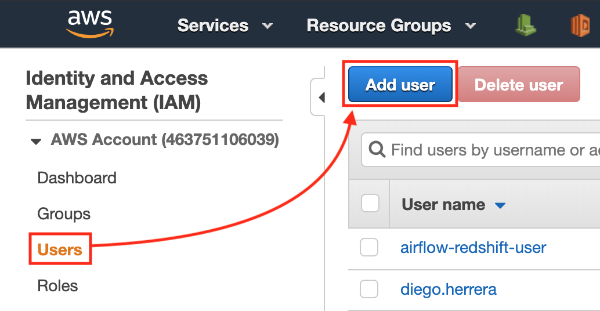

# Project: Data Warehouse

A music streaming startup, Sparkify, has grown their user base and song database and want to move their processes and data onto the cloud. Their data resides in S3, in a directory of JSON logs on user activity on the app, as well as a directory with JSON metadata on the songs in their app.

As their data engineer, you are tasked with building an ETL pipeline that extracts their data from S3, stages them in Redshift, and transforms data into a set of dimensional tables for their analytics team to continue finding insights in what songs their users are listening to. You'll be able to test your database and ETL pipeline by running queries given to you by the analytics team from Sparkify and compare your results with their expected results.

## Table of contents

- [Structure](#structure)
- [Model](#model)
  - [Dimension and fact tables](#dimension-and-fact-tables)
  - [Staging tables](#staging-tables)
- [Requirements](#requirements)
  - [Preparing AWS](#preparing-aws)
    - [Creating an administrator user](#creating-an-administrator)
    - [Activating STS](#activating-sts)
  - [Cloning the repository](#cloning-the-repository)
  - [Creating the virtual environment](#creating-the-virtual-environment)
- [How to use](#how-to-use)
  - [Creating the Sparkify stack](#creating-the-sparkify-stack)
  - [Initializing the database](#initializing-the-database)
  - [Running the ETL](#running-the-etl)
- [Analyzing the data](#analyzing-the-data)

---

## Model<a name="model"></a>

In addition to the Udacity nanodegree, I found this links about how to model data in AWS Redshift really interesting:

- AWS Redshift Reference: [CREATE TABLE](https://docs.aws.amazon.com/redshift/latest/dg/r_CREATE_TABLE_NEW.html)
- AWS Redshift Reference: [Distribution Styles](https://docs.aws.amazon.com/en_en/redshift/latest/dg/c_choosing_dist_sort.html)
- AWS Big Data Blog: [Distribution Styles and Distribution Keys](https://aws.amazon.com/blogs/big-data/amazon-redshift-engineerings-advanced-table-design-playbook-distribution-styles-and-distribution-keys/)

### Staging tables<a name="staging-tables"></a>


**Staging table `staging_events`**

This table has the field `artist` as the distribution key, and the field `song` as the sort key. Both fields will be used later to JOIN other tables to prepare the dimensions and fact data.

| Field         | Type       | PK | DISTKEY | SORTKEY | FK |
|---------------|------------|:--:|:-------:|:-------:|----|
| eventId       | INTEGER    | X  |         |         |    |
| artist        | VARCHAR    |    | X       |         |    |
| auth          | VARCHAR    |    |         |         |    |
| firstName     | VARCHAR    |    |         |         |    |
| gender        | VARCHAR(1) |    |         |         |    |
| itemInSession | INTEGER    |    |         |         |    |
| lastName      | VARCHAR    |    |         |         |    |
| length        | FLOAT      |    |         |         |    |
| level         | VARCHAR    |    |         |         |    |
| location      | VARCHAR    |    |         |         |    |
| method        | VARCHAR(7) |    |         |         |    |
| page          | VARCHAR    |    |         |         |    |
| registration  | BIGINT     |    |         |         |    |
| sessionId     | INTEGER    |    |         |         |    |
| song          | VARCHAR    |    |         | X       |    |
| status        | SMALLINT   |    |         |         |    |
| ts            | TIMESTAMP  |    |         |         |    |
| userAgent     | VARCHAR    |    |         |         |    |
| userId        | INTEGER    |    |         |         |    |

**Staging table `staging_songs`**

The same applies to this table: the field `artist_id` is used as the distribution key, and the field `song_id` as the sort key. The distribution style is KEY.

| Field            | Type          | PK | DISTKEY | SORTKEY | FK |
|------------------|---------------|:--:|:-------:|:-------:|----|
| song_id          | VARCHAR       | X  |         | X       |    |
| num_songs        | INTEGER       |    |         |         |    |
| title            | VARCHAR(1024) |    |         |         |    |
| artist_name      | VARCHAR(1024) |    |         |         |    |
| artist_latitude  | FLOAT         |    |         |         |    |
| year             | SMALLINT      |    |         |         |    |
| duration         | FLOAT         |    |         |         |    |
| artist_id        | VARCHAR       |    | X       |         |    |
| artist_longitude | FLOAT         |    |         |         |    |
| artist_location  | VARCHAR(1024) |    |         |         |    |

### Dimension and fact tables<a name="dimension-and-fact-tables"></a>


**Dimension table `time`**

This is a small table that can be replicated in every slice, so I set the distribution style as ALL.

| Field      | Type      | PK | DISTKEY | SORTKEY | FK |
|------------|-----------|:--:|:-------:|:-------:|----|
| start_time | TIMESTAMP | X  |         |         |    |
| hour       | SMALLINT  |    |         |         |    |
| day        | SMALLINT  |    |         |         |    |
| week       | SMALLINT  |    |         |         |    |
| month      | SMALLINT  |    |         |         |    |
| year       | SMALLINT  |    |         |         |    |
| weekday    | SMALLINT  |    |         |         |    |

**Dimension table `users`**

This table doesn't participate in any JOIN, so it has no distribution or sort keys. It's tiny, so the distribution style can be ALL.

| Field      | Type    | PK | DISTKEY | SORTKEY | FK |
|------------|---------|:--:|:-------:|:-------:|----|
| user_id    | INTEGER | X  |         |         |    |
| first_name | VARCHAR |    |         |         |    |
| last_name  | VARCHAR |    |         |         |    |
| gender     | VARCHAR |    |         |         |    |
| level      | VARCHAR |    |         |         |    |

**Dimension table `artists`**

The size of this table is reasonably small, so I decided to set its distribution style as ALL and make it available in every single slice to ease the JOIN clauses.

| Field     | Type          | PK | DISTKEY | SORTKEY | FK |
|-----------|---------------|:--:|:-------:|:-------:|----|
| artist_id | VARCHAR       | X  |         |         |    |
| name      | VARCHAR(1024) |    |         |         |    |
| location  | VARCHAR(1024) |    |         |         |    |
| latitude  | FLOAT         |    |         |         |    |
| longitude | FLOAT         |    |         |         |    |

**Dimension table `songs`**

Artists and songs are related to each other, so their identifiers are always good candidates to be involved in the data distribution. I set the `artist_id` as both the distribution and sort keys. Due to this, the distribution style is KEY.

| Field     | Type          | PK | DISTKEY | SORTKEY | FK                 |
|-----------|---------------|:--:|:-------:|:-------:|--------------------|
| song_id   | VARCHAR       | X  |         |         |                    |
| title     | VARCHAR(1024) |    |         |         |                    |
| artist_id | VARCHAR       |    | X       | X       | artists(artist_id) |
| year      | SMALLINT      |    |         |         |                    |
| duration  | FLOAT         |    |         |         |                    |

**Fact table `songplays`**

As I said, I see the relation artist > songs important enough to choose their identifiers to participate in the data distribution: the field `artist_id` is the distribution key, while the field `song_id` is the sort key. Therefore, the distribution style is KEY.

| Field       | Type      | PK | DISTKEY | SORTKEY | FK                 |
|-------------|-----------|:--:|:-------:|:-------:|--------------------|
| songplay_id | INTEGER   | X  |         |         |                    |
| start_time  | TIMESTAMP |    |         |         | time(start_time)   |
| user_id     | INTEGER   |    |         |         | users(user_id)     |
| level       | VARCHAR   |    |         |         |                    |
| song_id     | VARCHAR   |    |         | X       | songs(song_id)     |
| artist_id   | VARCHAR   |    | X       |         | artists(artist_id) |
| session_id  | INTEGER   |    |         |         |                    |
| location    | VARCHAR   |    |         |         |                    |
| user_agent  | VARCHAR   |    |         |         |                    |

## Structure<a name="structure"></a>

This tree shows the repository structure. Only the project's main files are described.

```
.
├── images
├── src
│   ├── config.py                  # Application config manager
│   ├── create_tables.py           # Database initialization script
│   ├── etl.py                     # ETL pipeline script
│   ├── sparkify_stack_create.py   # Script for the Sparkify stack creation
│   ├── sparkify_stack_delete.py   # Script for the Sparkify stack deletion
│   ├── sparkify_stack.json        # CloudFormation template of the Sparkify stack
│   ├── sparkify.cfg               # Application config file
│   ├── sql_queries.py             # Database queries
├── .editorconfig
├── .gitignore
├── README.md
└── requirements.txt
```

---

## Requirements<a name="requirements"></a>

It is assumed that the tools below are properly installed locally:

- [Python](https://www.python.org/) is a programming language that lets you work quickly and integrate systems more effectively. Versión 3.x is required.
- [pip](https://pip.pypa.io/en/stable/) is the package installer for Python.
- [Virtualenv](https://virtualenv.pypa.io/en/latest/) is a tool to create isolated Python environments.
- [Amazon Web Services](https://aws.amazon.com/) is the world's most comprehensive and broadly adopted cloud platform, offering over 165 fully featured services from data centers globally.

### Preparing AWS<a name="preparing-aws"></a>

Before running the ETL, we must tune up some things in our AWS account.

#### Creating an administrator user<a name="creating-an-administrator"></a>

**NOTE:** this step is necessary only if you don't have a user with privileges to manage AWS resources from the SDK.

Open the AWS console, log into your account and go to [IAM](https://console.aws.amazon.com/iam/home#/users). Choose _User_ from the left side menu, and then click the button _Add user_.



Fill in the _User name_ box. Also mark the _Programmatic access_ checkbox.


Now we must attach the policy `AdministratorAccess` to the user. Just select the option _Attach existing policies directly_, and then mark the policy's checkbox, down in the policies list.


And lastly, once the user is created, download its credentials clicking the button _Download .csv_. You can also copy the _Access key ID_ and the _Secret access key_ directly from the site and put them in a safe place. *Important:* never share this credentials to anyone, your AWS account can be compromised.


Have the user credentials on hand, we will use them right now. **NOTE:** you can use the credentials of any user having the proper permissions.

Go to the file `src/sparkify.cfg` and paste the credentials in the following keys:

```ini
...
ACCESS_KEY_ID = the-access-key-id
SECRET_ACCESS_KEY = the-secret-access-key
...
```

#### Activating STS<a name="activating-sts"></a>

Our Redshift cluster needs permissions to read a S3 bucket provisioned in US West (Oregon). This is the region `us-west-2`, where Udacity team stores the source data that we will be processing later. This can be achieved by letting the Redshift cluster to assume a role with the `AmazonS3ReadOnlyAccess` policy. Internally, this operation uses AWS Security Token Service (STS) to generate temporary credentials for the communication with S3. In order to make it work properly, we must enable STS in the mentioned region.

Go to [IAM](https://console.aws.amazon.com/iam/home#/account_settings) and choose _Account settings_ from the left side menu. Down in the section _Security Token Service (STS)_, click the link _Activate_ next to the region _US West (Oregon)_.


### Cloning the repository<a name="cloning-the-repository"></a>

The first step is to clone this repository. Just type the following command in your Terminal:

```bash
# Clone the repository...
git clone https://github.com/vermicida/data-warehouse.git

# ...and move to its directory
cd data-warehouse
```

### Creating the virtual environment<a name="creating-the-virtual-environment"></a>

Once the project is cloned, you must create a new virtual environment for it. You may have multiple Python versions installed, so it's important to specify the correct one with the `--python` argument. The code on this repository has been successfully tested over Python 3.6, but it must work on any Python 3 version; set the version that applies to your case in the following commands:

```bash
# Create the virtual environment...
virtualenv --python python3.6 project-env

# ...and activate it
source project-env/bin/activate
```

It's time to install the project's dependencies. You will use `pip` to do this job:

```bash
pip install -r requirements.txt
```

It will be ready in a minute.

---

## How to use<a name="how-to-use"></a>

TBD

### Creating the Sparkify stack<a name="creating-the-sparkify-stack"></a>

The Sparkify stack will create the following resources:

- A [AWS Redshift](https://aws.amazon.com/redshift/) cluster that we will use as data warehouse
- A [IAM](https://aws.amazon.com/iam/) role to access to S3 in a properly way

Go back to your Terminal and run the following script:

```bash
# Move to the directory src...
cd src

# ...and run the script to create the stack
python sparkify_stack_create.py
```

This action takes ~7 minutes. Once it's finished, copy the _Role ARN_ and the _Cluster endpoint_.


Now, open the file `src/sparkify.cfg` and paste this info in the corresponding keys:

```ini
...
ENDPOINT_ADDRESS = the-cluster-endpoint
ROLE_ARN = the-role-arn
...
```

### Initializing the database<a name="initializing-the-database"></a>

We must model our data before we can execute our ETL pipeline. Type this command in your Terminal:

```bash
python create_tables.py
```

This step is almost immediate.

### Running the ETL<a name="running-the-etl"></a>

This step will test your patience. It takes ~1 hour, and performs the actions described below:

- Copy the source data, stored in S3, into the staging tables. I decided to split the copy of the _song data_ in batches just to print out some info and give the user some feedback of the process.
- Populate the dimension tables collecting records about artists, songs, users and timestamps from the staging tables, and using them as source.
- Populate a fact table based on the dimensions previously created.

Run this command:

```bash
python etl.py
```

Now better go to eat something, take a nap, or watch the last episode of Stranger Things.

Just for fun, try to verify the number of records imported to every single table.

| Table          | Type      | Rows     |
|----------------|-----------|---------:|
| staging_events | Staging   |    8.056 |
| staging_songs  | Staging   |  385.252 |
| users          | Dimension |      105 |
| songs          | Dimension |  384.995 |
| artists        | Dimension |   45.266 |
| time           | Dimension |    8.023 |
| songplays      | Fact      |    7.268 |

---

## Analyzing the data<a name="analyzing-the-data"></a>

We can extract tons of valuable data from the data we have stored in our data warehouse. A basic fact could be to know what are the most listened artists.

Use any AWS Redshift client and run this query:

```sql
SELECT
    artists.name,
    temp.listeners
FROM (
    SELECT
        COUNT(songplays.artist_id) AS listeners,
        songplays.artist_id
    FROM public."songplays" as songplays
    GROUP BY songplays.artist_id
) AS temp
JOIN public."artists" AS artists
ON temp.artist_id = artists.artist_id
ORDER BY temp.listeners DESC
LIMIT 10;
```

You will get something like this:

| #  | Artist                          | Listeners |
|---:|---------------------------------|----------:|
|  1 | Kings Of Leon                   |        77 |
|  2 | Coldplay                        |        71 |
|  3 | The Killers / Lou Reed          |        62 |
|  4 | Eminem / Royce Da 5-9           |        59 |
|  5 | Kanye West / Paul Wall / GLC    |        56 |
|  6 | Three Drives                    |        55 |
|  7 | Waylon Jennings                 |        49 |
|  8 | John Mayer featuring DJ Logic   |        48 |
|  9 | Justin Bieber / Jessica Jarrell |        44 |
| 10 | Evanescence                     |        41 |
